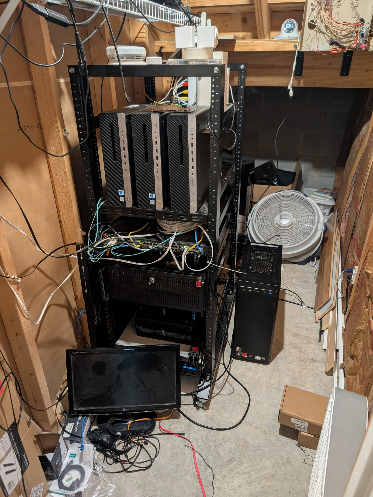
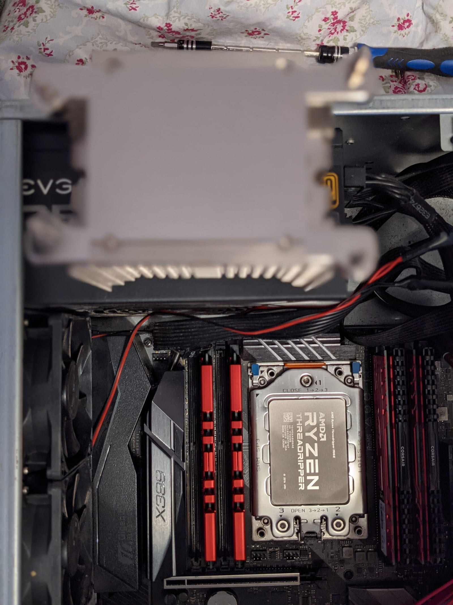
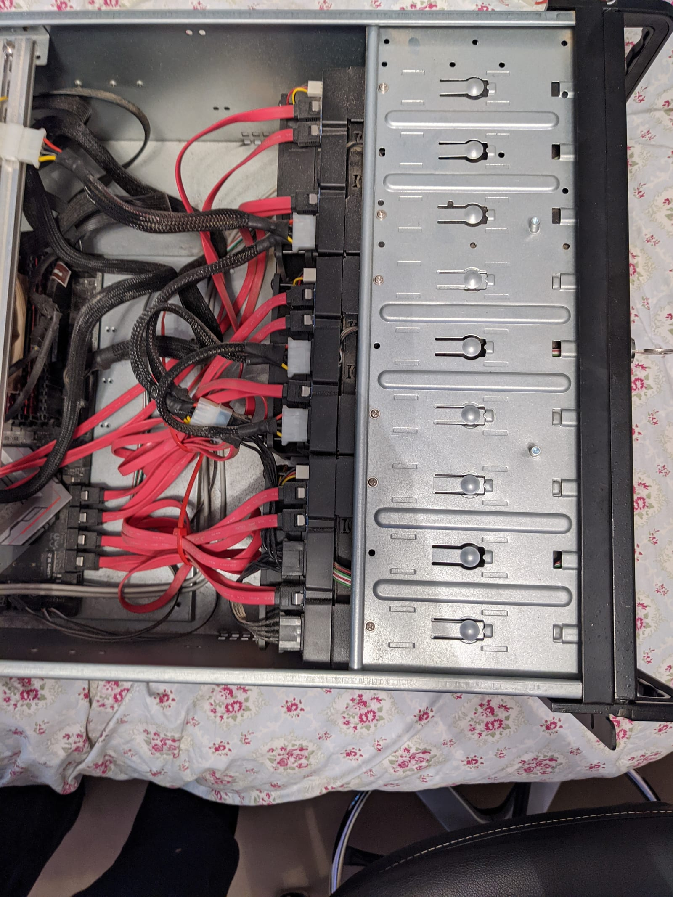
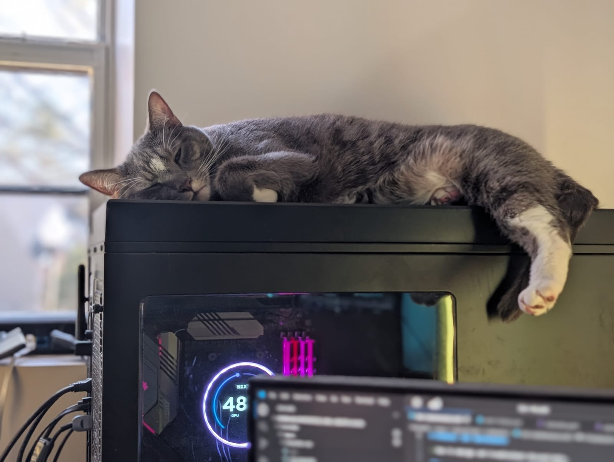

There is a full spec sheet on the [Labs page](/labs) if you just want the tables. This is
the other version, the one where I explain why any of it looks the way it does. Homelab
hardware is rarely a clean design. It is a fossil record of whatever was good, cheap, or
already sitting on a shelf when a problem needed solving.

*The whole cluster, in one corner of a basement. The 4U EPYC node sits under the switch, the three HP minis are stacked above, and pve-01 is the tower on the floor. It is probably fine.*

## Two tiers, on purpose

The cluster is five Proxmox nodes, and they are not equals.

Two of them do the heavy lifting. pve-00 is an EPYC 7282 with 256 GB of ECC memory in a 4U
hot-swap chassis, and it is the closest thing the lab has to a real server. pve-01 is a
Threadripper, which I will come back to because it has earned its own paragraph. Both run ECC
and both have discrete GPUs passed through to Kubernetes.

The other three are HP EliteDesk small-form-factor boxes with consumer i7s and no ECC. On
paper they are unremarkable. In practice they are perfect for what I ask of them: Ceph quorum,
OSD hosting, and soaking up the workloads that do not care what they run on. Not every node in
a cluster needs to be expensive. It needs to be present and predictable, and three cheap
office PCs clear that bar for a fraction of the cost and power of another real server.

That split is the single most useful decision in the whole build. It keeps the money on the
nodes that need it and treats the rest as the commodity capacity they are.

## The machine that will not retire

pve-01 is an ASRock Fatal1ty X399 board I bought in 2019 for a Threadripper workstation. Seven
years later it is still running, now as a cluster node. The CPU went from a 1900X to a 2920X,
the memory grew to 128 GB, and it picked up enterprise network cards along the way, but it is
the same board sitting on the same silicon platform I started with. The GTX 1080 Ti I gamed on
is still installed, except now it is passed through to a Kubernetes worker doing transcode and
inference instead of running games.

I keep it partly out of stubbornness and partly because it genuinely still pulls its weight.
There is something satisfying about a piece of hardware that has quietly survived every
architectural fad I have chased. It was a gaming rig, then a workstation, then a hypervisor,
and it never once needed replacing to make the jump.

It has outlived its own chassis, though. The X399 started in the 4U rackmount unit that now
holds pve-00. When I needed ECC RDIMM memory and more PCIe lanes, the new EPYC parts took over
the 4U and the Threadripper moved into the tower case from my old gaming PC, which is the one
now standing on the basement floor.

*The Threadripper that is now pve-01. Same socket, same board, several lifetimes of workloads.*

## Three GPU generations

The lab has three NVIDIA cards spanning three architectures: an Ada-generation 4070 Ti, a
Turing 1660, and the Pascal 1080 Ti. All three are passed straight through to Talos Kubernetes
workers.

Running three generations at once is not a flex, it is just what accumulates when you buy GPUs
over the better part of a decade and refuse to throw working hardware away. It does make
scheduling interesting. The newer cards get sliced up with MPS so several workloads can share
a single GPU, while the 1080 Ti stays dedicated to one job. Between them they handle media
transcode, local model inference, and whatever experiment I am currently pretending is
production.

## Storage, or: how I learned to fear distributed filesystems

Everything lives on Ceph now, on the order of 230 TiB raw spread across every node. Spinning
disks make up the bulk pool, NVMe backs the fast pool and local VM storage, and a couple of
Intel Optane drives handle metadata duty. The high NVMe counts hang off ASUS Hyper M.2 carrier
cards, four drives per card, using PCIe bifurcation to fan a single slot into four.

I arrived at Ceph the hard way. Before it I ran ZFS on each node with GlusterFS as the shared
layer, and Gluster and I did not part on good terms. Split-brains. Shards that would corrupt
and need tracking down by hand. Repairs that ran on their own schedule while I sat there
refreshing status output at 3am. The migration onto Ceph was its own multi-week project,
usually kicked off by a Proxmox upgrade deciding to be interesting at the worst possible time.

*The original X399 server's drive cages. All that red is SATA, and tracing it was exactly as fun as it looks.*

The lesson that stuck hardest is the boring one. Backups are not optional, and having backups
is not the same as having tested restores. Everything important now backs up to a dedicated
Proxmox Backup Server, and I actually restore from it on purpose sometimes, which is the only
way to know it works.

## The fabric is a museum

The network is where the fossil record shows most clearly.

A Brocade ICX6610 sits at the core with 10GbE SFP+ uplinks to every node and jumbo frames end
to end. Each node runs two 10GbE links in a two-bridge layout: one trunk for tenant and VM
traffic, a second that isolates storage and cluster replication on its own physical port. That
separation is what lets a firewall VM live-migrate from one node to another without dropping a
connection, which still feels a little like magic every time I watch it happen. Routing between
segments is handled by a high-availability OPNsense pair with CARP failover, the modern
descendant of that original $75 firewall.

The 10GbE cards themselves are a grab bag: Intel X550 in one node, Mellanox ConnectX-3 Pro in
another, Chelsio T320 in two more. They came from different eras and different deals, and they
all do the same job well enough that standardizing on one would be spending money to fix a
problem I do not have. Edge switching and wireless are UniFi.

## Power and heat

The bottom of the rack is a rackmount PSU feeding the major players, and above it sits a
dual-battery UPS that keeps the Raspberry Pis and the HP minis running through a blip. The
important machines shut down cleanly when the power stays out.

Cooling is where the enterprise pretense falls away completely. A box fan pushes the rack's
exhaust up into the foot-high gap between the ground-floor ceiling and the main floor of the
split-level house, and some of it bleeds into the garage through an insulated wall on the other
side. It is not a CRAC unit. It is a box fan and a cavity, and the practical upshot is that you
can feel the rack in the stairs and the floor above it. Homemade heated floors, sort of, if you
do not think about it too hard.

## The Pis do the quiet jobs

Off to the side of the cluster is a small fleet of Raspberry Pis, and they run the things that
should never share a failure domain with the cluster itself. Mainly home automation and
out-of-band tooling. If I take the whole cluster down for maintenance, the lights and locks
should still work, and the Pis are how that stays true.

They are named after Culture ships, which is the kind of joke you make when you spend enough
time alone with your infrastructure. Two Pi 5s do the real work, one on 16 GB with a 2 TB NVMe
drive on a PCIe hat, and they share a small bag of USB radios that move between them as needed:
a Z-Wave controller, a Zigbee and Thread stick, and a Coral TPU for edge ML.

## Why like this

None of this was designed top-down. It grew, one problem at a time, and the hardware reflects
that. The expensive parts are where the workloads actually demand them. The cheap parts are
doing real work anyway. The old parts are still here because they still function, and replacing
working hardware to make a diagram cleaner is a bad trade.

If there is a philosophy, it is that. Spend where it matters, reuse everything else, and let
the rack tell the story of how it got here.

*Roland Schitt, current cluster manager, signing off on the thermals.*

It's probably fine.

---

*Related: the [Kubernetes homelab case study](https://maxfieldallison.com/projects/homelab) on how the whole thing runs.*
